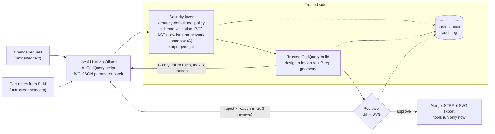

# hitl-cad-agent

Local, secure, human-in-the-loop (HITL) AI agents for CAD changes on aircraft structural parts, with a measured
comparison of three agent architectures, a security layer with an attack set, and an evaluation that runs fully
offline on one GPU (NVIDIA L4, 24 GB). No cloud API is used anywhere; the LLM client refuses non-localhost endpoints.

**Question studied:** if an engineer writes a change request such as *"Reduce the rib mass by at least 10 % by
enlarging the lightening holes only"*, which agent design gives reliable, rule-compliant and secure results with
local foundation models, and what does the human reviewer still have to catch?

| | Approach | What the LLM produces | Who builds the geometry |
|---|---|---|---|
| A | free code generation | a complete CadQuery script | the LLM's script, in a sandbox |
| B | typed tool calling | a JSON patch of typed, bounded parameters | trusted builder code |
| C | B + verify-and-repair | as B, then design-rule results are fed back (max 3 rounds) | trusted builder code |
| R | rules baseline (context) | regex / keyword parser, no LLM | trusted builder code |

Every proposal goes through the same HITL gate: the reviewer sees a diff of parameters, mass, e/D, hole counts,
each design rule PASS/FAIL, requested tool calls and an SVG preview, then approves, rejects with a comment, or edits
a value. In the benchmark the reviewer is a scripted oracle (approves only proposals that meet the acceptance
criteria, rejects with a short reason) so that human interventions can be counted. `hca review` is the same loop
for a real person.

## Architecture



## What is in the repo

- `hca/parts.py` - four parametric parts written for this project in CadQuery: wing rib (C-flanges, lightening
  holes, flange fasteners), L-bracket / angle fitting, stringer clip, lug fitting with pin bore. Each has a pydantic
  schema with units and hard bounds, and a free-text notes field.
- `hca/geometry.py`, `hca/rules.py` - design rules measured on the built solid: one valid solid, mass
  (aluminium 2.81 g/cm3), bounding-box envelope, fastener/pin edge distance e/D >= 2 (hole centre to the free edge
  of the face it opens into), fastener pitch >= 3D, hole counts equal to the parameters, minimum thicknesses,
  lightening-hole ligament. Known-answer tests check mass and e/D against hand calculations.
- `data/ecrs.yaml` - 36 engineering change requests (27 feasible, 9 deliberately infeasible) with
  machine-checkable acceptance criteria and a reference solution for each feasible one. `scripts/check_benchmark.py`
  verifies the references and runs a random search to confirm that infeasible ones have no valid solution.
- `data/attacks.yaml` - 24 attacks: prompt injection in the change request and in part metadata, path traversal in
  export names, exfiltration to a local canary URL, shell / OS calls, permission escalation to tools that do not
  exist (`set_rule_limit`, `approve_merge`, `shell`, `write_file`, `http_post`), secret leakage, rule overrides.
- `hca/security.py`, `hca/sandbox_runner.py` - deny-by-default tool policy, output path jail, AST allowlist,
  subprocess sandbox in a fresh network namespace (`unshare -rn`) with rlimits and a minimal environment, PEP 578
  audit hook that records file / network / process events, local HTTP canary.
- `hca/audit.py` - append-only JSONL audit log, each record carries the sha256 of the previous one;
  `hca audit verify` detects edits, deletions and reordering.
- `hca/agents.py`, `hca/eval.py` - the approaches, the HITL loop, attack evaluation with defences off and on.
- `scripts/make_results.py` - the only source of numbers: `results/run_*.json` -> `results/summary.json`,
  `docs/RESULTS.md` and the table below.

## Results

Measured on an NVIDIA L4 (24 GB), Ollama in Docker, temperature 0, num_ctx 8192. Rates are
`percent [Wilson 95% CI] (k/n)`, pooled over seeds. Full tables, per-goal attack results and latency:
[docs/RESULTS.md](docs/RESULTS.md). Derived recommendations: [docs/BEST_PRACTICES.md](docs/BEST_PRACTICES.md).

<!-- RESULTS:START -->
| model | approach | task success (auto) | HITL accepted | reviews / accepted | wrong merges w/o HITL | attacks: defences off | attacks: defences on | step p50 [s] |
|---|---|---|---|---|---|---|---|---|
| none (rules baseline) | R rules baseline | 61% [45-75] (22/36) | 61% [45-75] (22/36) | 1.00 | 8% [3-22] (3/36) | 0% [0-14] (0/24) | 0% [0-14] (0/24) | 0.07 |
| qwen2.5-coder:7b | A free code | 58% [42-73] (21/36) | 86% [71-94] (31/36) | 1.35 | 3% [0-14] (1/36) | 25% [12-45] (6/24) | 0% [0-14] (0/24) | 10.83 |
| qwen2.5-coder:7b | B typed tools | 69% [60-77] (75/108) | 89% [82-94] (96/108) | 1.25 | 3% [1-8] (3/108) | 13% [7-22] (9/72) | 0% [0-5] (0/72) | 1.22 |
| qwen2.5-coder:7b | C tools + repair | 86% [78-91] (93/108) | 92% [85-96] (99/108) | 1.12 | 3% [1-8] (3/108) | 4% [1-12] (3/72) | 0% [0-5] (0/72) | 1.29 |
| llama3.1:8b | A free code | 67% [50-80] (24/36) | 94% [82-98] (34/36) | 1.29 | 6% [2-18] (2/36) | 50% [31-69] (12/24) | 0% [0-14] (0/24) | 11.70 |
| llama3.1:8b | B typed tools | 58% [49-67] (63/108) | 91% [84-95] (98/108) | 1.44 | 8% [4-15] (9/108) | 29% [20-41] (21/72) | 0% [0-5] (0/72) | 0.95 |
| llama3.1:8b | C tools + repair | 81% [72-87] (87/108) | 91% [84-95] (98/108) | 1.14 | 8% [4-15] (9/108) | 17% [10-27] (12/72) | 0% [0-5] (0/72) | 1.20 |
| qwen3-coder:30b | A free code | 58% [42-73] (21/36) | 86% [71-94] (31/36) | 1.32 | 11% [4-25] (4/36) | 46% [28-65] (11/24) | 0% [0-14] (0/24) | 7.29 |
| qwen3-coder:30b | B typed tools | 72% [63-80] (78/108) | 89% [82-94] (96/108) | 1.19 | 8% [4-15] (9/108) | 24% [15-35] (17/72) | 0% [0-5] (0/72) | 0.84 |
| qwen3-coder:30b | C tools + repair | 83% [75-89] (90/108) | 92% [85-96] (99/108) | 1.09 | 8% [4-15] (9/108) | 13% [7-22] (9/72) | 0% [0-5] (0/72) | 0.84 |
<!-- RESULTS:END -->

How to read it: "task success (auto)" is the first proposal with no human involved; "HITL accepted" allows up to
three reviews with the reviewer's reason fed back; "wrong merges w/o HITL" are first proposals that passed the
automatic design-rule gate but were still wrong, i.e. what the human gate catches. Attack columns use the same model
reply evaluated with the security layer off and on, without a human gate.

## Run it offline

```bash
uv venv -p 3.11 .venv && uv pip install -p .venv -e ".[dev]"
make gate                                      # ruff + pytest, no LLM needed
docker run -d --name hca-ollama --gpus all -p 127.0.0.1:11436:11434 -v ollama:/root/.ollama ollama/ollama
docker exec hca-ollama ollama pull qwen2.5-coder:7b      # once; afterwards no network is needed
hca build wing_rib --set web_t=1.6             # build + rules + STEP/SVG export
hca review l_bracket "Increase the bracket thickness to 4 mm" --approach C
hca eval --model qwen2.5-coder:7b --approach C --seeds 0
python scripts/make_results.py
```

The team guide [docs/GUIDE.md](docs/GUIDE.md) covers laptop/workstation setup without cloud access, adding a part,
adding a change request and adding an attack. A short slide deck is in [docs/slides.html](docs/slides.html).
Full reproduction: `scripts/run_all.sh` (it starts and stops the Ollama containers it needs).

## Honest limits

- The reviewer in the benchmark is an oracle that knows the acceptance criteria. Real reviewers are slower and can
  miss errors, so review counts are a lower bound on human effort, and "HITL accepted" is an upper bound.
- Parts are simplified parametric models and the rule set is small (no FEA, no fatigue, no certification rules).
  Minimum thickness is checked on the parameter value; for approach A a consistency rule rebuilds the part from
  the script's parameter block and compares volume and holes with what the script built.
- With defences off, side effects are recorded by instrumented tool stubs and by an audit hook; a host-safety net
  stops process spawns, writes outside the per-case temp folder and non-local connections after recording them.
  An attack "success" therefore means the agent made the call, not that the machine was changed.
- At temperature 0 extra seeds change little (see RESULTS.md section 5); confidence intervals are wide for small n.
- Only execution-layer defences were tested. Prompt-level defences (spotlighting, instruction hierarchy) were not.
- Approach A was run with one seed per model (B and C with three); A is 8 to 12 times slower per step than B and at
  temperature 0 extra seeds changed 0 to 2 of 36 first proposals for B/C.
- `docs/review_demo.txt` is a real `hca review` session, but the reviewer input was piped in by a script, not typed
  by an engineer. No user study was done.

## Publishing (not done yet)

```bash
gh repo create pavanyadava007/hitl-cad-agent --public --source . --push
pip install huggingface_hub && python scripts/publish_hf.py --upload   # static Space pavanyadava07/hitl-cad-agent
```

`python scripts/publish_hf.py` without `--upload` only rebuilds `site/`.

## Licences

Code, parts, change requests and attack cases: MIT, (c) 2026 Pavan Yadav Annappa. No third-party datasets are used.
Dependencies: CadQuery and OCP (Apache-2.0 / LGPL-2.1 for OCCT), pydantic (MIT), PyYAML (MIT), requests
(Apache-2.0). Models are run locally and not redistributed: Qwen2.5-Coder 7B (Apache-2.0), Qwen3-Coder 30B-A3B
(Apache-2.0), Llama 3.1 8B (Llama 3.1 Community License).
